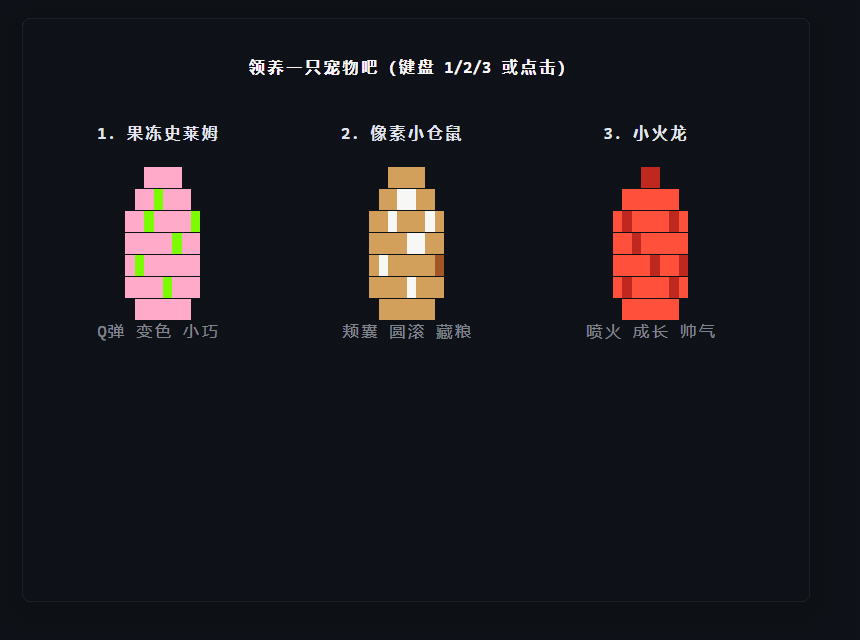
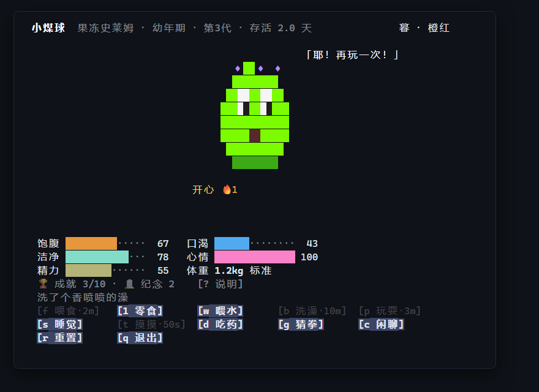
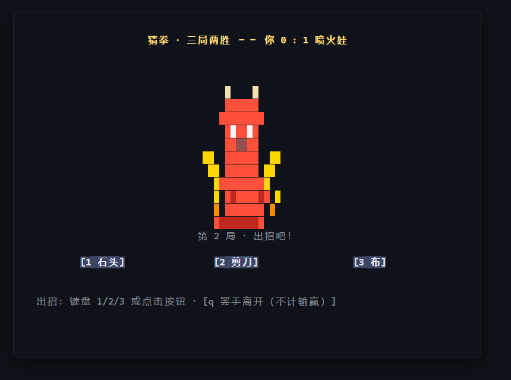
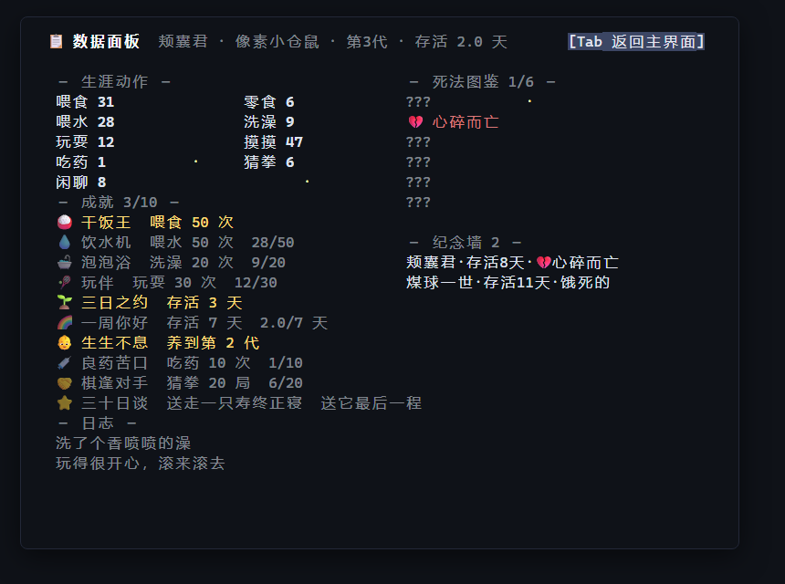
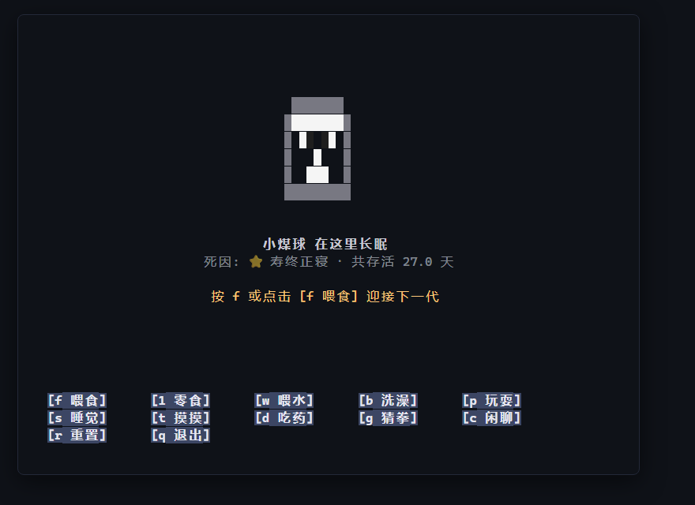
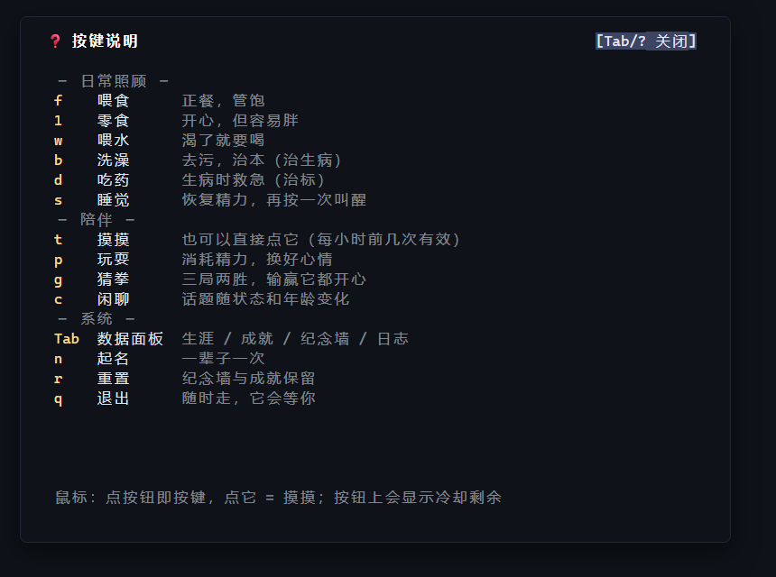

**English** | [简体中文](README.zh-CN.md)

# cli-pet

```
  ┌────────────────────────────────────────────────┐
  │   🥚  →  🐣  →  🐾  →  ⭐      c l i - p e t   │
  │        a tiny life in your terminal            │
  └────────────────────────────────────────────────┘
```

A pixel-art virtual pet that lives in your terminal. Single file, zero dependencies, zero network — open a pane, hatch an egg, and check in on it while you work.

[](LICENSE)
[](#install)
[](#install)
[](#install)
[](#install)
[](https://github.com/ntexplorer/cli-pet/releases)

> **Heads-up:** in-game text is currently Simplified Chinese (the project was born Chinese-first). English localization is on the roadmap — [#1](https://github.com/ntexplorer/cli-pet/issues/1). Everything else works in any terminal, any language.

## See it move



*A full life in under a minute: pick an egg → feed, pet and bathe a slime → a full best-of-3 RPS match against a dragon (shake, reveal, showdown) → the career dashboard → and eventually, a grave. Recorded from real output — no mockups anywhere in this README.*

## Gallery

| Pick an egg | Daily care | Rock-paper-scissors |
|:---:|:---:|:---:|
|  |  |  |

| Career dashboard | The end (of this one) | Key reference |
|:---:|:---:|:---:|
|  |  |  |

## Why

Terminals are where we live all day — so a pet should live there too, without stealing attention:

- **Workday-paced, not needy.** Stats decay is tuned so something is worth doing every 25–30 minutes across an 8-hour day. Not a fire alarm, more like a colleague who occasionally wants a snack.
- **Never punishes you for having a life.** No background process, no notifications. Time catches up on next launch, and your pet **cannot die while you're away** — offline stats have a floor and the dying clock freezes.
- **One file, zero everything.** `pet.mjs` is the whole program. No install script, no package.json, no network, no telemetry. Read it in one sitting (it's ~1200 lines).
- **A real arc.** Egg → baby → adult → elder (day 21+) → one of six deaths → mourning → next generation. Achievements and the memorial wall carry across generations.

## Install

Requires **Node.js ≥ 18**. That's the whole dependency list.

```bash
# get it
git clone https://github.com/ntexplorer/cli-pet.git ~/.config/cli-pet
node ~/.config/cli-pet/pet.mjs
```

```powershell
# PowerShell flavor
git clone https://github.com/ntexplorer/cli-pet.git "$env:USERPROFILE\.config\cli-pet"
node "$env:USERPROFILE\.config\cli-pet\pet.mjs"
```

Make it a command:

```bash
# bash / zsh: ~/.bashrc or ~/.zshrc
alias pet="node $HOME/.config/cli-pet/pet.mjs"
```

```powershell
# PowerShell: $PROFILE
function pet { node "$env:USERPROFILE\.config\cli-pet\pet.mjs" @args }
```

Your save lives next to the script as `state.json` (gitignored). Delete it to start over — or use the in-app `r` reset, which keeps achievements and the memorial wall.

<details>
<summary><b>Optional: give it a permanent pane</b> (any terminal works — it's just text)</summary>

| Terminal | Recipe |
|----------|--------|
| Windows Terminal | split a pane (`Alt+Shift+D`) and run `pet`; or from a terminal: `wt -w 0 nt pwsh -NoLogo -c pet` |
| tmux | `tmux split-window -h -p 30 'pet'` |
| wezterm *(author's pick)* | bind a key to a 3-pane workspace: opencode / sleev / pet — see the author's [dotfiles](https://github.com/ntexplorer/ai-dev-setup) |

If the pane is narrow the layout adapts automatically; force a width with `PET_WIDTH=60 pet`.
</details>

## Features

**Life & body**
- **Three species** — slime / hamster / dragon, each with distinct egg sprites, baby & adult pixel art (adult form unlocked through care)
- **Five stats** — hunger, thirst, cleanliness, mood, energy; real-time decay
- **Full life arc** — egg (3 min hatch, with cracks & wiggles) → baby → adult → **elder from day 21** (fading but cozy) → dying (4 h rescuable window) → grave → mourning → next generation
- **Weight system** — overfeed and it visibly gets wider (and mood-capped); meals vs snacks, and snacks are *way* more tempting than meals
- **Six ways to go** — 🥀 starvation · 💔 broken heart · 🤒 untreated sickness · 🍰 overfeeding · ⚡ exhaustion · ⭐ old age (30 days, honorary). Unseen causes show as `???` in the death codex (Dead-Cells style)

**Things to do together**
- **Rock-paper-scissors** — `g` starts a best-of-3 match (`1`/`2`/`3` to throw); every throw plays a shake-then-reveal pixel animation — winner's hand lit and lifted, loser's dimmed. Each species has throw preferences you can learn, elders get stubborn, and matches always end with a happier pet
- **Small talk** — `c` chats; what it says depends on stats, life stage and earned achievements — sick pets whine, elders reminisce
- **Begging & theater** — needy pets beg (water bowl > food > play > bath priority); healthy ones improvise little scenes every 2–5 min

**Terminal bling**
- **Needy visuals** — dirt spots when dirty, droopy mouth when hungry, drowsy blink when tired, desaturation when sad, gray fur in old age
- **Wandering** — pets stroll left/right on their own, turn to face their heading, and shiver in their final hours
- **Day/night ambience** — real-clock sky label (morning/day/dusk/night) and stars at night; sleepy 23:00–7:00
- **Action feedback** — every action plays a 2 s particle animation (falling food, water drops, rising bubbles, hearts…)
- **Keyboard + mouse** — single-key actions and SGR-1006 mouse clicks (buttons, click-the-pet-to-pet)

**Player QoL**
- **Offline-friendly** — no process, no network; catch-up math on launch, never dies while away
- **Adaptive layout** — auto-fits narrow panes; `PET_WIDTH` env override
- **Stats dashboard** — `Tab` for career stats, achievement progress (e.g. 12/50), memorial wall, full log
- **10 achievements** — career-wide, survive across generations
- **Anti-spam actions** — pets refuse what they don't need; each action shows a live cooldown on its button
- **`--fast` test mode** — `pet --fast` (or `--fast=120`) speeds the clock ×60: hatch in 3 s, a full life in ~20 min. Try every feature; keep it away from your real pet's save

## Controls

| Key | Action | Effect |
|----|--------|--------|
| `1` `2` `3` | pick egg | choose species |
| `f` | feed meal | hunger +32, weight +0.15 |
| `1` | snack | hunger +8, mood +12, fatter — refused only above 85 hunger; the 3rd snack within an hour upsets its stomach (medicine is the only cure) |
| `w` | water | thirst +35 |
| `b` | bath | clean +45, cures sickness (root cure), hunger −6, thirst −6 — a hot bath works up both an appetite and a thirst |
| `d` | medicine | when sick: instant cure (the only cure for an upset stomach), mood −20, energy −15 — grime-sickness returns in 1 h without a bath |
| `p` | play | mood +28, energy −15, clean −5 (playing gets dirty), −0.2 kg burn — refused if hungry <20, thirsty <20, or dying |
| `s` | sleep toggle | recovers energy fast (40/h; 4/h while awake), hungers slower asleep — other actions refused while sleeping |
| `t` | pet it | mood +10 (60 s cooldown) — or click the pet; gets annoyed (mood −3) past 2 pets per rolling hour (3 when elderly, +12 each) |
| `g` | rock-paper-scissors | best-of-3, throw with `1`/`2`/`3`, `q` to bow out — win: mood +15, energy −8, care +1 · lose: mood +5 · 3 min CD |
| `c` | small talk | mood +2 (60 s cooldown); topics react to stats, age and achievements |
| `Tab` | stats dashboard | career stats, achievement progress, memorial wall, full log |
| `?` | key reference | all keys at a glance (`?` or `Tab` to close); hinted once after hatching |
| `n` | name (once) | up to 8 chars, CJK OK — the name sticks afterwards |
| `r` | reset | keeps memorial & achievements, `y` to confirm |
| `q` | quit | saves on exit |

## Mechanics

| Mechanic | Value |
|----------|-------|
| Decay (per hour) | thirst −26 · hunger −20 (−16 asleep) · mood −18 · clean −11 |
| Refusal thresholds | won't eat >65 hunger · drink >65 thirst · bathe >60 clean · play >90 mood · snack >85 hunger |
| Cooldowns | feed/water 90 s · touch 60 s · chat 60 s · play 3 min · rps 3 min · snack 5 min · bath 10 min · medicine 3 min |
| Typical cadence | play ~every 30 min · water ~1.3 h · feed ~1.75 h · bath ~4 h — something to do every 25–30 min |
| Sickness | three sources: grime (clean < 25 for 1 h) · chill (20%/h roll below clean 30) · upset stomach (3rd snack within an hour) → appetite halved, mood capped; baths cure grime & chill, only medicine cures an upset stomach |
| Dying | hunger AND thirst both 0 → 4 h rescue window (feed + water); total collapse (energy & mood also 0) compresses it to 1 h |
| Death timers | each terminal state (mood 0 · sick · 1.6× obese · awake at 0 energy) kills after 2 h if untreated — red countdown badge warns you; obesity is rescuable — playing burns weight (see active metabolism) |
| Active metabolism | plays within 10 min stack a buff (max 3): weight burn +0.1×stack/h, fades 20 min after the last play · 🔥 badge shows stacks |
| Elder stage | from day 21: smaller meals (+22), play tires it (−22 energy, +20 mood), lighter sleep (30/h), slower metabolism, lonelier (mood −22/h), grayer & slower sprite — but cozier: 3 free pets/h (+12), richer chats (+4), stubborn RPS throws · ⭐ days-left badge |
| Old age | survive 30 days → ⭐ honorary passing (achievement 三十日谈) |
| Death codex | Tab → 6-entry gallery; unseen causes show `???` |
| Interlocks | play needs hunger ≥20 & thirst ≥20 · eating needs thirst ≥20 · sleep needs energy ≤95 · awake at 0 energy = exhausted (locked, must sleep) |
| Offline | stats floored (30/20), dying clock frozen — never dies away |
| Death → next egg | 2 h mourning → press `f` at the grave |

## FAQ

- **Where is my save?** `state.json` beside `pet.mjs`. It survives reinstalls; don't commit it.
- **Can I run two instances?** No — a PID lock refuses the second one to protect the save.
- **Pane too narrow?** The layout adapts: below 68 columns the button bar switches to one-character labels (full key reference in `?`); below 58 cols × 25 rows it shows a friendly notice and recovers automatically once you enlarge the window. Force a width with `PET_WIDTH=60 pet`.
- **Does it phone home?** Never. No network, no telemetry.
- **English UI?** Not yet — in-game text is Chinese for now; it's on the roadmap ([#1](https://github.com/ntexplorer/cli-pet/issues/1)) and help is welcome.

## Contribute

The whole game is one readable file, and most contributions are shockingly small: a new species is a string array, a new achievement is one line, a new chat line is just… a string. See [CONTRIBUTING.md](CONTRIBUTING.md) — ideas welcome (especially species art and i18n help).

## License

[MIT](LICENSE) © ntexplorer
