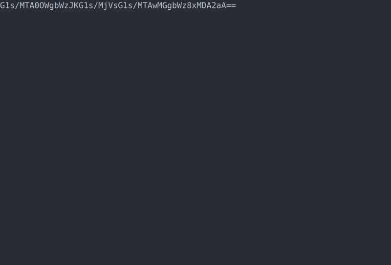

[English](README.md) | **简体中文**

# cli-pet

```
  ┌────────────────────────────────────────────────┐
  │   🥚  →  🐣  →  🐾  →  ⭐      c l i - p e t   │
  │              在你终端里的小小生命               │
  └────────────────────────────────────────────────┘
```

一只住在终端里的像素电子宠物。单文件、零依赖、零网络 —— 开一个 pane，孵一颗蛋，干活的时候顺手看看它。

[](LICENSE)
[](#安装)
[](#安装)
[](#安装)
[](#安装)
[](https://github.com/ntexplorer/cli-pet/releases)

## 动图先行



*40 秒过完一生：选蛋 → 喂食/摸摸/洗澡 → 和小火龙猜一局拳 → 生涯数据面板 → 最后，一座墓碑。全部录制自真实运行输出 —— 本 README 里没有任何示意图/手绘 mock。*

## 界面一览

| 选蛋 | 日常照顾 | 猜拳 |
|:---:|:---:|:---:|
|  |  |  |

| 生涯数据面板 | 告别（这一只的） |
|:---:|:---:|
|  |  |

## 为什么做这个

我们一整天都泡在终端里 —— 宠物也该住在这儿，而且不该抢走注意力：

- **按工作日节奏设计，不当爹。** 数值衰减调校为 8 小时工作日内每 25–30 分钟有一件事值得做。不是火灾警报，更像一个偶尔想讨点零嘴的同事。
- **绝不为「你有自己的生活」惩罚你。** 无后台进程、无通知推送。时间在下一次启动时结算追赶，而且宠物**在你离开期间绝不会死** —— 离线数值有托底，濒死时钟冻结。
- **一个文件，什么都没有。** `pet.mjs` 就是整个程序。无安装脚本、无 package.json、无网络、无遥测。一口气就能读完（约 1000 行）。
- **完整的一生。** 蛋 → 幼年 → 成年 → 暮年（第 21 天起）→ 六种死法之一 → 守灵 → 下一代。成就与纪念墙跨代继承。

## 安装

需要 **Node.js ≥ 18**。依赖清单到此为止。

```bash
# bash / zsh
git clone https://github.com/ntexplorer/cli-pet.git ~/.config/cli-pet
node ~/.config/cli-pet/pet.mjs
```

```powershell
# PowerShell
git clone https://github.com/ntexplorer/cli-pet.git "$env:USERPROFILE\.config\cli-pet"
node "$env:USERPROFILE\.config\cli-pet\pet.mjs"
```

做成命令：

```bash
# ~/.bashrc 或 ~/.zshrc
alias pet="node $HOME/.config/cli-pet/pet.mjs"
```

```powershell
# $PROFILE
function pet { node "$env:USERPROFILE\.config\cli-pet\pet.mjs" @args }
```

存档在脚本旁边的 `state.json`（已 gitignore）。删掉即重来 —— 或用游戏内 `r` 重置（保留成就与纪念墙）。

<details>
<summary><b>可选：给它一个常驻 pane</b>（任何终端都行 —— 它只是文本）</summary>

| 终端 | 做法 |
|------|------|
| Windows Terminal | 分屏（`Alt+Shift+D`）后运行 `pet`；或任意终端里执行 `wt -w 0 nt pwsh -NoLogo -c pet` |
| tmux | `tmux split-window -h -p 30 'pet'` |
| wezterm *（作者自用）* | 绑定一键三 pane 工作区：opencode / sleev / pet —— 见作者的 [dotfiles](https://github.com/ntexplorer/ai-dev-setup) |

pane 太窄会自动适配；用 `PET_WIDTH=60 pet` 强制指定宽度。
</details>

## 特性

**生命与身体**
- **三个物种** —— 史莱姆 / 小仓鼠 / 小火龙，各有独立蛋画、幼年与成年像素立绘（成年形态靠照顾解锁）
- **五项数值** —— 饱腹、口渴、洁净、心情、精力；实时衰减
- **完整一生** —— 蛋（3 分钟孵化，裂纹+摇动）→ 幼年 → 成年 → **第 21 天起暮年**（衰而温馨）→ 弥留（4 小时可救）→ 墓园 → 守灵 → 下一代
- **体重系统** —— 喂多了真的会变宽（且心情被压上限）；正餐与零食两种食物，零食的诱惑力远大于正餐
- **六种死法** —— 🥀 饿死 · 💔 心碎 · 🤒 病亡 · 🍰 撑死 · ⚡ 猝死 · ⭐ 寿终（30 天，荣誉性）。未见过的死因在图鉴里显示 `???`（死亡细胞风格）

**一起玩的事**
- **猜拳** —— `g` 开三局两胜；每个物种有可学习的出招偏好，暮年更固执，而且无论输赢宠物都很开心
- **闲聊** —— `c` 聊两句；话题随数值/年龄/已获成就变化 —— 生病会哼哼，暮年会怀旧
- **乞讨与小剧场** —— 缺东西会主动讨（水碗 > 食物 > 玩耍 > 洗澡）；状态好时每 2–5 分钟自编自演小剧场

**终端演出**
- **状态可视化** —— 脏了有污渍、饿了瘪嘴、困了打盹眨眼、心情差会褪色、暮年毛发变灰
- **漫游** —— 自己左右遛弯、转身朝向前进方向、最后几小时会发抖
- **昼夜氛围** —— 按真实时钟的天色标签（清晨/白天/黄昏/夜晚）、夜间星空；23:00–7:00 犯困
- **动作反馈** —— 每个动作 2 秒粒子动画（落下的食物、水滴、上浮的泡泡、爱心…）
- **键盘 + 鼠标** —— 单键操作，支持 SGR-1006 鼠标点击（按钮、点它摸摸）

**玩家体验**
- **离线友好** —— 无进程无网络；启动时结算追赶，离开期间绝不死
- **自适应布局** —— 窄 pane 自动适配；`PET_WIDTH` 环境变量覆盖
- **数据面板** —— `Tab` 看生涯统计、成就进度（如 12/50）、纪念墙、完整日志
- **10 个成就** —— 跨代继承的生涯成就
- **防刷设计** —— 不需要就拒绝；按钮上实时显示冷却
- **`--fast` 测试模式** —— `pet --fast`（或 `--fast=120`）时钟 ×60：3 秒孵化、约 20 分钟过完一生。方便试遍所有功能；注意别和正式宠物共用存档

## 操作

| 键 | 动作 | 效果 |
|----|------|------|
| `1` `2` `3` | 选蛋 | 选择物种 |
| `f` | 喂食（正餐） | 饱腹 +32，体重 +0.15 |
| `1` | 零食 | 饱腹 +8，心情 +12，更易发胖 —— 饱腹 85 以上才拒绝 |
| `w` | 喂水 | 口渴 +35 |
| `b` | 洗澡 | 洁净 +45，治本（痊愈） |
| `d` | 吃药 | 仅生病时：立刻缓解，心情 −20、精力 −15 —— 脏污还在，不洗澡 2 小时后复发 |
| `p` | 玩耍 | 心情 +28，精力 −15，洁净 −5（玩得一身泥）—— 饱腹/口渴 <20 或弥留时拒绝 |
| `s` | 睡觉（切换） | 精力快速恢复（睡 40/h；醒 4/h），睡着饿得慢 —— 睡着时其他动作全拒 |
| `t` | 摸摸 | 心情 +10（冷却 60 秒）—— 也可以直接点它；滚动 1 小时内前 2 次有效，超出心情 −3（暮年 3 次，每次 +12） |
| `g` | 猜拳 | 三局两胜 —— 赢：心情 +15、精力 −8、照顾 +1 · 输：心情 +5 · 冷却 3 分钟 |
| `c` | 闲聊 | 心情 +2（冷却 60 秒）；话题随状态、年龄、成就变化 |
| `Tab` | 数据面板 | 生涯统计、成就进度、纪念墙、完整日志 |
| `n` | 起名（一次） | 最多 8 字，中文 OK —— 定名后固定 |
| `r` | 重置 | 保留纪念墙与成就，`y` 确认 |
| `q` | 退出 | 自动存档 |

## 机制数值

| 机制 | 数值 |
|------|------|
| 每小时衰减 | 口渴 −26 · 饱腹 −20（睡 −16）· 心情 −18 · 洁净 −11 |
| 拒绝阈值 | 吃 >65 · 喝 >65 · 洗 >60 · 玩（心情）>90 · 零食 >85 |
| 冷却 | 喂食/喂水 90 秒 · 摸摸 60 秒 · 闲聊 60 秒 · 玩耍 3 分 · 猜拳 3 分 · 零食 5 分 · 洗澡 10 分 · 吃药 3 分 |
| 典型节奏 | 玩耍约 30 分钟一次 · 喂水约 1.3 小时 · 喂食约 1.75 小时 · 洗澡约 4 小时 —— 25–30 分钟总有一事可做 |
| 生病 | 洁净 <15 持续 2 小时 → 食欲减半、心情封顶；洗澡治本，吃药治标 |
| 弥留 | 饱腹且口渴双 0 → 4 小时救援窗口（喂食+喂水）；全面崩溃（精力心情也 0）压缩至 1 小时 |
| 死亡计时 | 各绝症状态（心情 0 · 生病 · 1.6× 超重 · 醒着精力 0）2 小时未处理即死 —— 屏幕上有红色倒计时角标 |
| 暮年期 | 第 21 天起：进食 +22、玩耍 −22 精力/+20 心情、睡眠恢复 30/h、代谢慢更易胖、心情衰减 22/h、立绘变灰变慢 —— 但更温馨：摸摸配额 3 次（+12）、闲聊 +4、猜拳更固执 · ⭐ 剩余天数徽章 |
| 寿终 | 活满 30 天 → ⭐ 荣誉离世（成就「三十日谈」） |
| 死法图鉴 | Tab → 6 格图鉴；未见过的显示 `???` |
| 联动约束 | 玩耍需饱腹/口渴 ≥20 · 进食需口渴 ≥20 · 睡觉需精力 ≤95 · 醒着精力归零 = 精疲力尽（锁定，必须睡） |
| 离线 | 数值托底（30/20）、濒死时钟冻结 —— 离开期间绝不死 |
| 死亡 → 下一颗蛋 | 守灵 2 小时 → 墓前按 `f` |

## FAQ

- **存档在哪？** `pet.mjs` 旁边的 `state.json`。重装不受影响；别提交它。
- **能开两个实例吗？** 不能 —— PID 锁会拒绝第二个实例以保护存档。
- **pane 太窄？** 布局自动适配；`PET_WIDTH=60 pet` 强制宽度。
- **会联网吗？** 永远不会。无网络、无遥测。
- **英文界面？** 暂无 —— 游戏内文案目前是中文；英文界面在路线图上，欢迎搭把手。

## 参与贡献

整个游戏就是一个可读性很高的单文件，大多数贡献小得惊人：新物种是一个字符串数组，新成就是一行，新闲聊台词就是……一个字符串。见 [CONTRIBUTING.md](CONTRIBUTING.md) —— 欢迎各种点子（尤其是物种像素画和国际化的帮助）。

## 许可

[MIT](LICENSE) © ntexplorer
